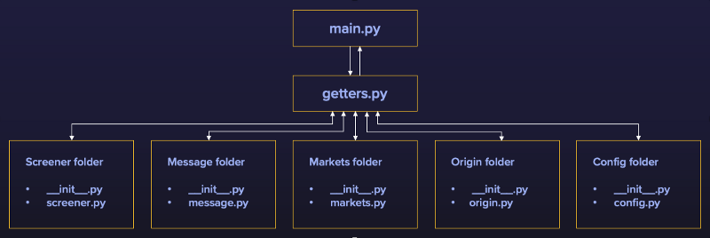

# Tracking portfolio and Cryptos

The goal of this repo is to provide a pleasant architecture to code with for tracking your portfolio updates as well as crypto variation.
It is sufficiently flexible for anyone to add modules, new functions, etc. I have let one function from my personal code, so that people can understand the logic the code follows.
Please create issues if you see some and participate if you want by creating pull requests. Any contribution is appreciated :blush: 

First, assuming you have your python set-up, to get access to all the dependencies you need to run from the root of the project :
```
pip install requirements.txt
```

## The modules

There are 5 modules yet. Since the code is very flexible, anyone can add new ones that can very easily plug in the existing structure. All there is to is create a get_function in thegetters.py and call it in main.py. For instance, you can add an orders module that can send buy/sell orders to the market. My project aimed to be informative but if you feel like turning it into a trading bot, it can quickly be done.

- **Markets**: Essentially, what that module does is initiate a connector to the specified market in the config file. There are subclasses to each exchange in case you want specific functions for particular exchanges. 
- **Screener**: This is the module that scraps data and computes what you want.
- **Message**: I chose to be informed through telegram. Therefore, this module allows to send me a specific message on triggering events. That way, I know for instance when AVAX increased by at least 5% within the last 24h. 
- **Account**: As CCXT renders unreadable dict,JSON files, I created a Wallet class to clean this data, to access your net balance in the currency you want, etc. 
- **Origin**: Not so much a module but rather a file to store both the tokens you have and at what price they were acquired. That way, you can stay informed, through the message module of your daily portfolios update for instance.

Finally, I didn't mention it before but you need to store your private and public keys somewhere. And load it directly into the `config.py` file. I let you handle it the way you want to secure it by yourself. 
Just to make it more clear, I did this little graph structure:



Since you want to have the code run in background to always have your updates I recommend using `tmux` to emulate a terminal that will not be killed when closing your computer.
Check documentation [here](https://www.hamvocke.com/blog/a-quick-and-easy-guide-to-tmux/).